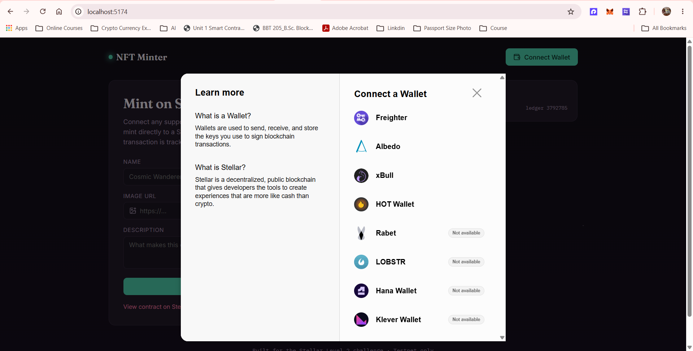
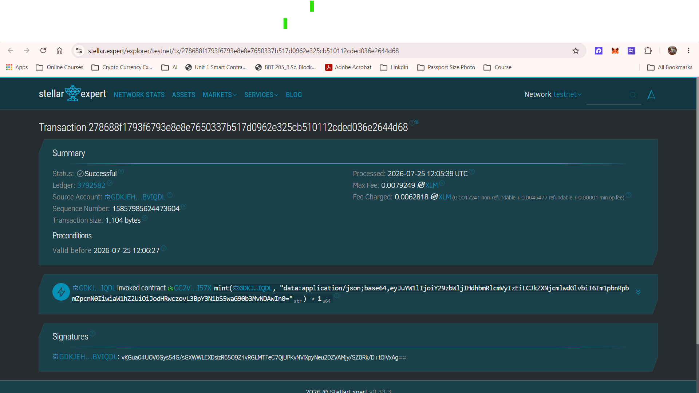

# NFT Minter — Stellar Soroban

Mint NFTs on the Stellar testnet through a Soroban smart contract, with
multi-wallet support, real-time transaction status, and a live mint
activity feed.

Built for the **Level 2 – Yellow Belt** challenge (multi-wallet
integration, contract deployment, real-time event handling).

## Features

- **Multi-wallet connect** via [StellarWalletsKit](https://github.com/Creit-Tech/Stellar-Wallets-Kit) — Freighter, Albedo, xBull, Lobstr, Rabet, and hardware wallets all show up in one picker.
- **Typed error handling** for wallet-not-found, user-rejected, and insufficient-balance cases (`src/utils/errors.js`), each with a distinct message and `.code` for programmatic checks.
- **Live transaction status** — a step tracker shows build → simulate → sign → submit → confirm, with a link to Stellar Expert once a hash exists.
- **Real-time activity feed** — polls Soroban RPC `getEvents` for the contract's `mint` events so new mints appear without a refresh.
- **Soroban NFT contract** (`contract/`) — mint, transfer, `owner_of`, `token_uri`, `balance_of`, `total_supply`, with unit tests.

## Tech stack

| Layer | Choice |
|---|---|
| Frontend | React 18 + Vite |
| Wallets | StellarWalletsKit (multi-wallet) |
| Chain SDK | `@stellar/stellar-sdk` |
| Contract | Soroban (Rust), `soroban-sdk` 21.x |
| Icons | lucide-react |

## Project structure

```
nft-minter/
├── contract/
│   ├── Cargo.toml
│   └── src/lib.rs          # mint / transfer / owner_of / events
├── src/
│   ├── context/WalletContext.jsx   # StellarWalletsKit wiring
│   ├── components/
│   │   ├── WalletButton.jsx
│   │   ├── MintForm.jsx
│   │   ├── TransactionStatus.jsx
│   │   ├── ActivityFeed.jsx
│   │   ├── MintedGallery.jsx
│   │   └── Toast.jsx
│   ├── hooks/useContractEvents.js  # polling-based live event feed
│   ├── utils/
│   │   ├── errors.js        # WalletNotFoundError, UserRejectedError, InsufficientBalanceError
│   │   ├── stellar.js       # build/simulate/sign/submit + balance checks
│   │   └── contract.js      # mintNft(), owner_of(), explorer links
│   ├── App.jsx
│   └── index.css
├── .env.example
└── package.json
```

## Setup

### Prerequisites

- Node.js 18+
- Rust + the `wasm32v1-none` target, and the [Stellar CLI](https://developers.stellar.org/docs/tools/cli/install-cli) (`stellar` command)
- A funded testnet account — create one with `stellar keys generate <name> --network testnet --fund`
- A browser wallet extension: [Freighter](https://www.freighter.app/) is the easiest for testing

### 1. Clone and install

```bash
git clone https://github.com/TechPradnya/soroban-nft-minter.git
cd soroban-nft-minter
npm install
```

### 2. Configure environment

```bash
cp .env.example .env
```

Leave `VITE_NFT_CONTRACT_ID` blank until you deploy the contract (next step), or use the already-deployed contract ID below.

### 3. Build and deploy the contract

```bash
cd contract
rustup target add wasm32v1-none

stellar contract build

stellar contract deploy \
  --wasm target/wasm32v1-none/release/nft_minter_contract.wasm \
  --source <your-identity> \
  --network testnet

# Copy the returned contract ID into .env as VITE_NFT_CONTRACT_ID, then initialize it:
stellar contract invoke \
  --id <CONTRACT_ID> \
  --source <your-identity> \
  --network testnet \
  -- initialize --admin <YOUR_PUBLIC_KEY>
```

> Minting itself does not require the admin's signature — any connected
> wallet can mint directly to itself (`to.require_auth()` in `mint()`).
> The admin recorded at `initialize` is reserved for potential future
> admin-only actions and isn't currently gating any user-facing flow.

### 4. Run the frontend

```bash
npm run dev
```

Open the printed local URL (typically `http://localhost:5173`), connect a wallet, and mint.

## Error handling

Three error types are explicitly caught and surfaced with distinct
messages, satisfying the "3 error types handled" requirement:

1. **Wallet not found** — thrown when a selected wallet extension isn't installed.
2. **User rejected** — thrown when the wallet's signature prompt is declined.
3. **Insufficient balance** — checked before building a transaction, using the account's live XLM balance from Horizon.

All three are normalized in `src/utils/errors.js` and rendered inline in
the mint form, not just logged to the console.

## Deployed contract

| Field | Value |
|---|---|
| Contract ID | `CC2VCAKMLTV5TTJBUHVJCZHYRA2J2WFILOEKHZV74KUH45O45STNI57X` |
| Network | Testnet |
| Explorer | https://stellar.expert/explorer/testnet/contract/CC2VCAKMLTV5TTJBUHVJCZHYRA2J2WFILOEKHZV74KUH45O45STNI57X |
| Sample mint tx | *(see contract explorer link above — click "View on Stellar Explorer" in the app after minting, or check the contract's transaction history)* |

## Screenshots



 

 


## Live demo

https://soroban-nft-minter.vercel.app/

## Notes on scope

This is intentionally a single-collection NFT contract rather than a
full marketplace — that keeps the surface area small enough to actually
understand end-to-end, which matters more for a submission like this
than bolting on features you can't explain. Transfers, balance lookups,
and a live event feed are included because they directly demonstrate
the "read/write + event sync" requirements; a full marketplace,
auctions, or royalties are deliberately left out as out-of-scope for
this level.
